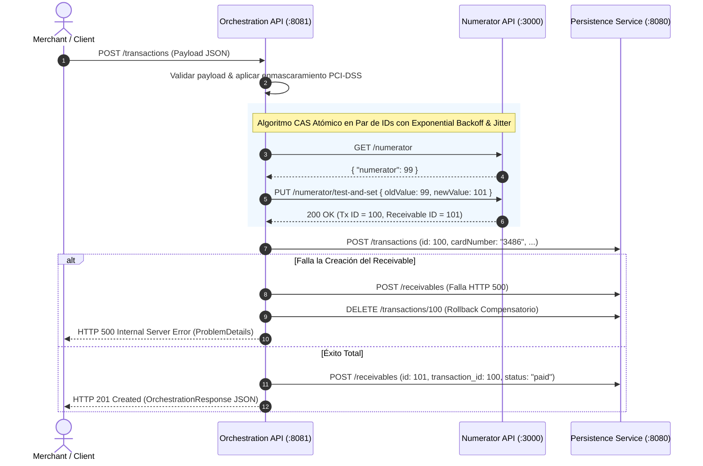

# Merchant Transactions Orchestration API

## 📌 1. Documentación Funcional (¿Qué es y para qué sirve esta API?)

La **Merchant Transactions Orchestration API** es un microservicio de orquestación financiera diseñado para procesar transacciones de compras iniciadas por merchants (comerciantes), calcular de forma automática las comisiones y cuentas por cobrar (*receivables*), y almacenar de forma consistente la información entre sistemas externos.

### Propósito y Responsabilidades Clave
1. **Punto de Entrada Unificado (`POST /transactions`)**:
   - Recibe la solicitud de cobro del cliente (monto, descripción, método de pago y datos de la tarjeta).
   - Valida la integridad de la solicitud bajo normas de seguridad financiera.

2. **Cumplimiento de Seguridad PCI-DSS**:
   - Sanitiza y enmascara automáticamente los datos sensibles de tarjetas de crédito/débito.
   - **Solo almacena y retorna los últimos 4 dígitos** del número de tarjeta. El código CVV es excluido de las respuestas HTTP enviadas a los clientes.

3. **Asignación Concurrente de IDs Únicos (Servicio `numerator-api`)**:
   - Garantiza la generación e incremento atómico de identificadores numéricos únicos tanto para la **Transacción** como para el **Receivable** correspondiente.

4. **Cálculo Automático de Receivables (Comisiones y Liquidación)**:
   - Determina la comisión aplicable y la fecha de acreditación según el método de pago elegido:
     - **Tarjeta de Débito (`debit_card`)**: Comisión **2%**, acreditación **mismo día ($D+0$)**, estado **`paid`**.
     - **Tarjeta de Crédito (`credit_card`)**: Comisión **4%**, acreditación **30 días posteriores ($D+30$)**, estado **`waiting_funds`**.

5. **Consistencia Transaccional y Rollback por Compensación**:
   - Coopera de manera atómica con los servicios subyacentes. Si la creación de la transacción en `json-server` resulta exitosa pero la posterior creación del receivable falla, la API ejecuta inmediatamente una **transacción de compensación (`DELETE /transactions/{id}`)**, evitando registros huérfanos.

---

## 🚀 2. Stack Tecnológico y Características de Java 21 LTS

| Tecnología | Versión | Propósito / Característica Destacada |
| :--- | :--- | :--- |
| **Java** | **21 LTS** | Runtime y lenguaje de programación principal. |
| **Spring Boot** | **3.4.3** | Framework web empresarial con `RestClient` reactivo/sincrónico. |
| **Puerto de la API** | **`8081`** | **Puerto HTTP asignado a la API Java de Orquestación**. |
| **OpenAPI / Swagger** | **2.8.5** | Documentación interactiva en `http://localhost:8081/swagger-ui/index.html`. |

### Novedades de Java 21 LTS Implementadas en Código
- **Java 21 Virtual Threads (Project Loom)**: Activado nativamente (`spring.threads.virtual.enabled=true`) para el manejo masivo de peticiones concurrentes sin bloqueo de I/O.
- **Java 21 Record Classes**: Clases `record` inmutables nativas para DTOs.
- **Java 21 Sequenced Collections**: Acceso seguro y expresivo a colecciones ordenadas mediante `.getFirst()`.
- **Pattern Matching & Switch Expressions**: Expresiones de coincidencia de patrones nativas en Java 21.

---

## 🔒 3. Concurrencia y Algoritmo CAS (Compare-And-Swap)

Para garantizar identificadores únicos y secuenciales sin generar cuellos de botella por bloqueos distribuidos (locks), la API implementa el algoritmo atómico **Compare-And-Swap (CAS)** mediante el endpoint `PUT /numerator/test-and-set`.

### Funcionamiento de CAS en `NumeratorClient`
1. Obtiene el valor actual del numerador (`oldValue`) mediante `GET /numerator`.
2. Intenta actualizar atómicamente a `newValue = oldValue + 2` usando `PUT /numerator/test-and-set` para reservar el par de IDs de Transacción y Receivable en **una sola llamada atómica**.
3. Si el valor actual en el servidor coincide con `oldValue`, el servidor actualiza el valor y retorna `200 OK`.
4. Si otra petición concurrente modificó el numerador en el servidor, retorna `400 Bad Request` con el valor actualizado (`currentNumerator`).
5. **Reintentos con Backoff Exponencial y Jitter**: En caso de conflicto (400) o error de red, la API reintenta automáticamente aplicando un retraso exponencial aleatorizado (Jitter) para evitar el efecto jauría (*thundering herd*).

---

## 📊 4. Reglas de Negocio Financieras

| Método de Pago | Formato JSON | Tasa de Comisión | Fecha de Liquidación | Estado del Receivable |
| :--- | :--- | :--- | :--- | :--- |
| **Tarjeta de Débito** | `debit_card` | **2%** | $D+0$ (Mismo día) | `paid` |
| **Tarjeta de Crédito** | `credit_card` | **4%** | $D+30$ (30 días posteriores) | `waiting_funds` |

---

## 🏗️ 5. Diagrama de Secuencia de Orquestación



---

## ⚡ 6. Guía de Inicio Rápido y Puertos

### Puertos de los Servicios
- **`orchestration-api` (API Java Spring Boot)**: **`http://localhost:8081`**
- **`persistence-api` (`json-server`)**: **`http://localhost:8080`**
- **`numerator-api` (Generador de IDs)**: **`http://localhost:3000`**

### Levantar con Docker Compose

```bash
docker-compose up --build -d
```

### Documentación Interactiva Swagger UI

Acceder desde el navegador a:
👉 **`http://localhost:8081/swagger-ui/index.html`**

---

## 🧪 7. Pruebas y Cobertura ($\ge 95\%$ JaCoCo)

Ejecutar la suite completa de pruebas unitarias e integración:

```bash
./gradlew clean test jacocoTestReport jacocoTestCoverageVerification
```

---

## 📮 8. Colección de Postman

La colección oficial se encuentra ubicada en la raíz de `orchestration-api`:
📄 [`postman_collection.json`](./postman_collection.json)
